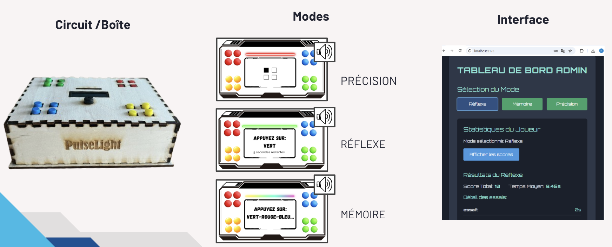
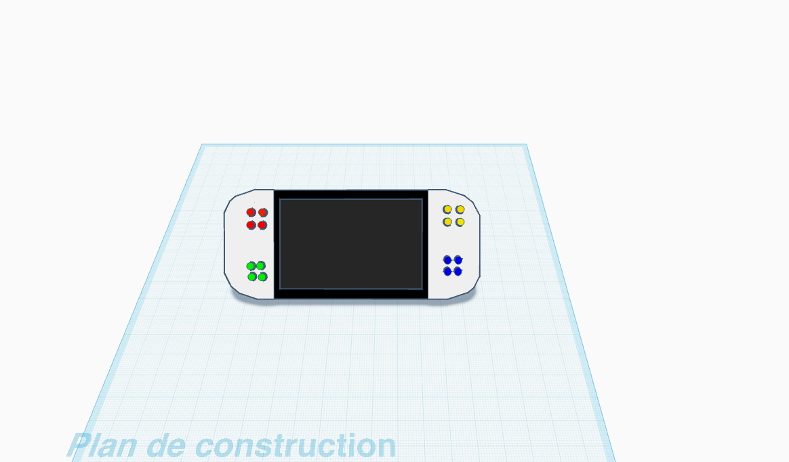
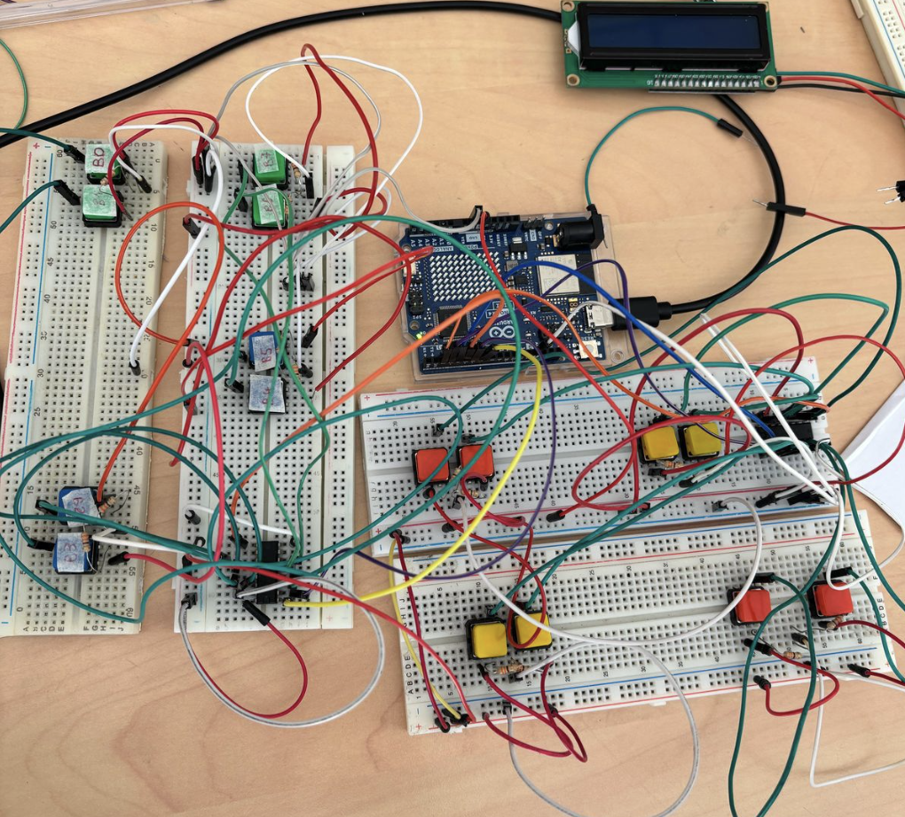
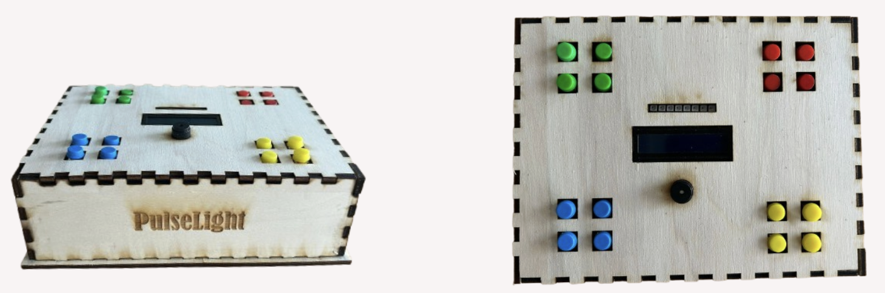
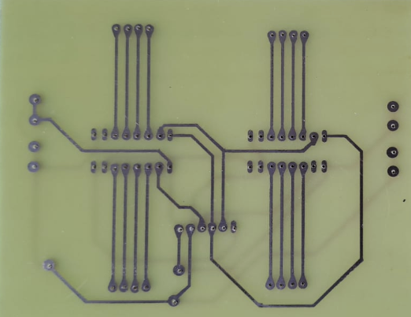
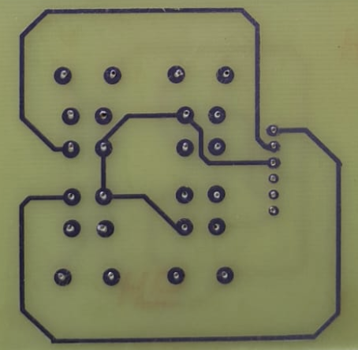

#  PulseLight – Cognitive Reflex & Memory Trainer

**An interactive Arduino-based medical system for cognitive rehabilitation**  
Developed to assess and improve cognitive and motor abilities such as **memory**, **reflex**, and **precision**, while monitoring **heart rate** in real time.  
This project bridges **electronics**, **web technologies**, and **healthcare**.

---

## Overview

**PulseLight** is a **connected medical rehabilitation prototype** designed to help clinicians and patients evaluate and train cognitive skills through interactive exercises.  

The system combines:
- A **physical game interface** (Arduino-based with LEDs, buttons, and pulse sensor)  
- A **Node.js backend** for communication and data handling  
- A **React web dashboard** for remote monitoring and control  

**Target Users**
- Elderly patients maintaining cognitive abilities  
- Post-stroke (AVC) rehabilitation patients  
- Medical staff and therapists supervising sessions  

---

## Objectives

- Design a compact, user-friendly medical training tool  
- Evaluate **reflex time**, **memory accuracy**, and **precision** through interactive modes  
- Monitor **heart rate** and **stress levels** in real time  
- Enable **remote control** and **data collection** via a web interface  

---

## System Architecture

PulseLight integrates **hardware**, **firmware**, and **software** into a single interactive ecosystem:

[User] ⇄ [Arduino UNO R3] ⇄ [Node.js Server] ⇄ [React Web Dashboard]

| Layer | Component | Role |
|:------|:-----------|:------|
| **Hardware** | Arduino UNO R3, LEDs, Buttons, Buzzer, LCD, Pulse Sensor | Data collection & user interaction |
| **Firmware** | Arduino (C++) | Controls sensors, LEDs, modes, and data flow |
| **Server** | Node.js + Express | Serial communication & REST API |
| **Frontend** | React | Remote control and real-time data visualization |

---

## Hardware Setup

| Component | Function |
|------------|-----------|
| **Arduino UNO R3** | Central controller |
| **Pulse Sensor Amped** | Measures heart rate (40–200 BPM) |
| **LCD I2C Display** | Displays scores and feedback |
| **Neopixel LEDs (x16)** | Provides visual feedback |
| **Push Buttons (x16)** | User input interface |
| **Piezo Buzzer** | Audio cues |
| **Custom PCB** | Clean integration of circuit components |
| **Wooden Box** | Compact, ergonomic housing |

# Prototype Photos**

| Prototype | PCB | Button PCB |
|------------|-----|-------------|
|  |  |  |

---

## Software Architecture

### Arduino Firmware

**Folder:** `/arduino_code`

The firmware is modular for clarity and scalability:

arduino_code/

├── main/

│ └── PulseLight.ino # Main control logic

├── modes/

│ ├── memoire.ino # Memory mode

│ ├── reflexe.ino # Reflex mode

│ └── precision.ino # Precision mode

Each mode implements its own logic for timing, sequence generation, scoring, and LED feedback.

---

# Cognitive & Reflex Training System 

This project is a multi-modal interactive system designed for cognitive and reflex training, with integrated physiological data monitoring.

## Game Modes

| Mode | Description | Key Features |
| :--- | :--- | :--- |
| **Memory** | Player reproduces a sequence of lights. | Progressive difficulty, error tracking. |
| **Reflex** | Player reacts to fast-changing LEDs. | Measures reaction time with $0.1$ s precision. |
| **Precision** | Player selects the correct color/button. | Tests accuracy and coordination. |
| **Sound** | Responds to auditory cues. | Integrates buzzer-based signals. |

---

## Physiological Data

The system incorporates robust monitoring and data export capabilities:

* **Heart Rate Monitoring:** $40-200$ BPM range
* **Stress Evaluation:** Based on **HRV** (Heart Rate Variability)
* **Data Export:** Stored locally for later analysis

### Example Output (Simulated)
Mode: Reflexe
Heart Rate: 78 BPM
Reaction Time: 2.83 s
Score: 120

# Testing & Validation

All core components and system integrations have been rigorously tested.

| Test Type | Description | Status |
|-----------|-------------|--------|
| Unit Test – Buttons | Verified detection and debouncing. | Passed |
| Unit Test – LEDs | Checked color accuracy and timing. | Passed |
| Unit Test – Buzzer | Confirmed tone generation. | Passed |
| Integration Test | Mode logic + data recording. | Passed |
| User Test | Usability with elderly & stroke patients. | Validated |

---

## Reports

| Document | Description |
|----------|-------------|
| Detailed_Report.pdf | Complete engineering documentation. |
| Quick_Presentation.pdf | Slide summary of the system. |

---

## Future Improvements

-  Wireless communication (Bluetooth / Wi-Fi)
-  Cloud-based dashboard and analytics
-  AI-based cognitive pattern recognition
-  Touchscreen integration
-  Compact custom PCB redesign

---

## 👥 Authors & Contributors

| Name | Role & Contributions |
|------|----------------------|
| **Sara El Bari** | Project Lead – Software Development, Arduino Programming, Game Mode Logic (`memoire`, `reflexe`, `precision`), System Integration |
| **Nihal Lachghir** | Electronics  – Circuit design, wiring, and hardware integration |
| **Tinhinen** | Electronics – Component setup, sensor calibration, and testing |
| **Justine Brissart** | PCB Designer – Custom PCB creation and optimization |
| **Niamatellah lahkim** | Frontend Developer – Web Interface (React) and administrator dashboard |

---

## License

This project is open-source under the **MIT License**.  
You are free to reuse, modify, and distribute it for educational or research purposes.

---

## Acknowledgments

Developed as part of an engineering project on human-machine interaction and medical rehabilitation.  
Special thanks to our professors, mentors, and lab staff for their invaluable guidance and feedback.
